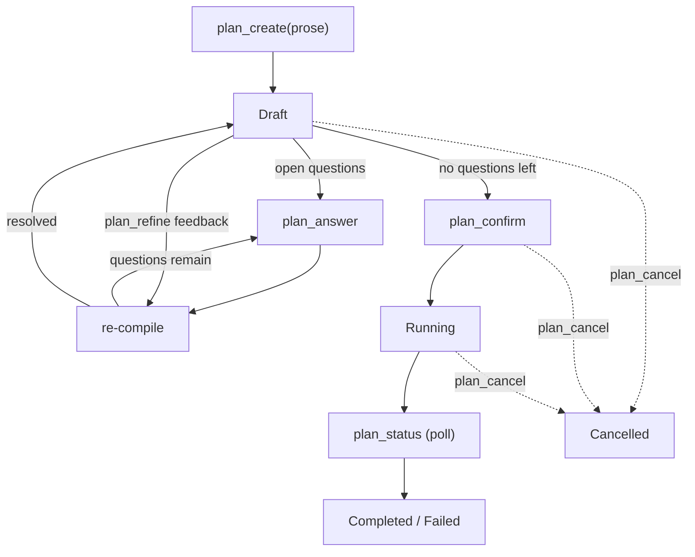

# flowd

Local-first memory, orchestration, and rules engine for AI coding agents. Exposes an MCP server so Claude Code and Cursor can persist context, run multi-step plans, and gate actions against user-defined rules.

## Table of Contents

- [Architecture](#architecture)
- [Install](#install)
  - [Qdrant via Podman](#qdrant-via-podman)
- [Intended usage flow](#intended-usage-flow)
  - [1. Check status](#1-check-status)
  - [2. Wire your agent](#2-wire-your-agent)
  - [3. Use the agent](#3-use-the-agent)
    - [Workspace and project scoping](#workspace-and-project-scoping)
    - [Plan integration (`plan_integrate`)](#plan-integration-plan_integrate)
  - [4. Observe out-of-band](#4-observe-out-of-band)
  - [5. Inspect](#5-inspect)
    - [Plan event log](#plan-event-log)
    - [Plan usage rollup](#plan-usage-rollup)
  - [6. Shut down](#6-shut-down)
- [Recommendations](#recommendations)
- [Development](#development)
- [License](#license)

## Architecture

Five crates, no implicit coupling:

| Crate            | Role                                                                        |
| ---------------- | --------------------------------------------------------------------------- |
| `flowd-core`     | Traits and domain types: memory, rules, orchestration. No I/O.              |
| `flowd-storage`  | `SQLite` backend with FTS5 keyword search and WAL-mode concurrent readers.  |
| `flowd-vector`   | Qdrant vector index backend.                                                |
| `flowd-onnx`     | ONNX embedding provider (runs on CPU thread pool).                          |
| `flowd-mcp`      | JSON-RPC 2.0 MCP server. Generic over backends; pulls in no storage deps.   |
| `flowd-cli`      | `flowd` binary. Composes the stack and wires the daemon lifecycle.          |

Search is hybrid: FTS5 keyword and ANN vector results merged via Reciprocal Rank Fusion. Keyword search works without the daemon; vector search needs Qdrant and a running `flowd start`.

## Install

Prerequisites:

- Rust 1.85 or newer
- Qdrant reachable on `http://localhost:6334` (default; see [Qdrant via Podman](#qdrant-via-podman) or override with `flowd start --qdrant-url`)

Hooks are now first-class `flowd hook <event>` subcommands, so the install footprint is just the `flowd` binary on `$PATH` -- no `bash`, `jq`, or `uuidgen` required.

Build and install:

```bash
cargo install --path crates/flowd-cli
```

This writes the `flowd` binary to `~/.cargo/bin`, which should already be on `$PATH` if you installed Rust via `rustup`.

### Qdrant via Podman

`flowd` talks to Qdrant over gRPC on port `6334`. The recommended local setup is a named container backed by a named volume so the index survives container churn:

```bash
podman volume create qdrant-data

podman run -d \
  --name qdrant \
  --restart=unless-stopped \
  -p 6333:6333 \
  -p 6334:6334 \
  -v qdrant-data:/qdrant/storage:Z \
  docker.io/qdrant/qdrant:v1.17.0
```

Port `6333` exposes the REST API and dashboard at <http://localhost:6333/dashboard>. Port `6334` is the gRPC endpoint `flowd` uses. The `:Z` suffix is a no-op on macOS and does the correct SELinux relabel on Linux.

Day-to-day:

```bash
podman start qdrant      # after reboot or `podman machine` restart
podman stop qdrant
podman logs -f qdrant
```

#### Autostart on Linux (user systemd)

`--restart=unless-stopped` only fires while the user's Podman session is alive, so on a fresh login (or after reboot) the container stays down. To make Qdrant survive both, generate a user systemd unit from the running container and enable lingering so the unit keeps running after logout:

```bash
mkdir -p ~/.config/systemd/user
podman generate systemd --new --name qdrant > ~/.config/systemd/user/qdrant.service
systemctl --user daemon-reload
systemctl --user enable --now qdrant.service
sudo loginctl enable-linger "$USER"
```

`--new` makes the unit recreate the container from the image on each start (rather than depending on a pre-existing container by id), so the unit is portable across reinstalls. `podman generate systemd` is deprecated in Podman 4.4+ in favour of [Quadlet](https://docs.podman.io/en/latest/markdown/podman-systemd.unit.5.html) (`~/.config/containers/systemd/qdrant.container`), but the generated unit remains supported and is the most direct path from `podman run` to a managed service.

To upgrade, pull the new tag and recreate the container against the same volume:

```bash
podman pull docker.io/qdrant/qdrant:v1.17.1
podman rm -f qdrant
podman run -d --name qdrant --restart=unless-stopped \
  -p 6333:6333 -p 6334:6334 \
  -v qdrant-data:/qdrant/storage:Z \
  docker.io/qdrant/qdrant:v1.17.1
```

Pin tags explicitly. Floating tags like `v1.17` or `latest` make "it worked yesterday" impossible to reproduce.

> [!NOTE]
> **macOS:** `podman machine start` must be running for the container to be reachable on `localhost`. `--restart=unless-stopped` only takes effect while the machine is up; the machine itself is not auto-started by Podman Desktop unless you enable it.

## Intended usage flow

### 1. Check status

```bash
flowd status
```

Reports the flowd home layout, daemon liveness, row counts per memory tier, and a `tokens:` block summing plan-event spend across four windows: today, this week (Monday-anchored), this month, and all-time. Boundaries are UTC half-open (`[start, end)`) so they line up with the `created_at` column `SQLite` writes. Costs round to two decimals here -- the per-step `flowd plan events` view keeps four-decimal precision for spot checks. Token splits (input / output / cache_read / cache_creation) are shown for the all-time totals only; per-period token splits would dilute the spend signal without changing operator decisions:

```text
tokens:
  this week:      $4.21  (132 step events)
  today:          $0.87
  this month:     $18.04
  all-time:       $42.19  (1,420 step events)
  input:          1,204,310
  output:         812,005
  cache_read:     8,942,118
  cache_creation: 1,041,772
```

A fresh install shows zero rows, no PID, and a `none -- no metrics-bearing step events yet` line in place of the block above.

### 2. Wire your agent

- **Cursor.** Run `flowd init cursor --global` (writes `~/.cursor/mcp.json`) or `flowd init cursor --project <path>` (writes `<path>/.cursor/mcp.json`). The command deep-merges the canonical server stanza into any existing file and pins the `command` to the absolute path of the running `flowd` binary; rerunning is a no-op. `integrations/cursor/mcp.json` is kept as a reference snapshot for manual merges.
- **Claude Code.** Merge `integrations/claude-code/settings.json` into `~/.claude/settings.json` (deep-merge `mcpServers` and `hooks` so your existing keys survive). Hooks are now bare `flowd hook session-start`, `flowd hook post-tool-use`, `flowd hook session-end` commands -- no `/ABSOLUTE/PATH` substitution, no shell scripts to source. Assumes the `flowd` binary is on `$PATH`.

Run the daemon before starting Cursor or Claude Code. Clients should launch `flowd mcp`, which bridges their stdio MCP session to the daemon's local socket at `$FLOWD_HOME/flowd.sock`. The proxy is spawned *by the IDE inside the workspace it has open*, so it also stamps the invoking workspace onto outbound `plan_create` requests as `project_root` -- see [Workspace and project scoping](#workspace-and-project-scoping) for how that signal is resolved and verified.

For local macOS use, keep it as a background process next to Qdrant:

```bash
podman machine start
podman start qdrant
mkdir -p "${FLOWD_HOME:-$HOME/.flowd}"
flowd start >> "${FLOWD_HOME:-$HOME/.flowd}/flowd.log" 2>&1 &
```

Check and stop it with:

```bash
flowd status
flowd stop
```

### 3. Use the agent

The agent now has fifteen MCP tools. Inside a Claude Code or Cursor session:

| Tool             | When the agent calls it                                                           |
| ---------------- | --------------------------------------------------------------------------------- |
| `memory_store`   | To persist a decision, design note, or tool result.                               |
| `memory_search`  | To recall prior observations by keyword or semantic similarity.                   |
| `memory_context` | Auto-injection at file or session scope (skips cold tier).                        |
| `plan_create`    | To submit a plan, either as a structured DAG (`definition`) or as `prose`.        |
| `plan_answer`    | To resolve open clarification questions emitted by the prose-first compiler.      |
| `plan_refine`    | To apply freeform feedback to a draft plan and re-compile.                        |
| `plan_confirm`   | To advance a plan from draft to running after human review.                       |
| `plan_cancel`    | To abandon a draft, confirmed, or running plan.                                   |
| `plan_status`    | To poll execution progress.                                                       |
| `plan_resume`    | To reset failed or interrupted steps and re-execute from the failure boundary. Not for fixing a plan rooted in the wrong repo -- see [Recovery rule](#recovery-rule-abandon-do-not-resume). |
| `plan_list`      | To list persisted plan summaries.                                                 |
| `plan_show`      | To inspect one persisted plan snapshot.                                           |
| `plan_recent`    | To recover recent plan ids after restarting an agent client.                      |
| `rules_check`    | Pre-flight gate before a risky tool invocation.                                   |
| `rules_list`     | To enumerate rules active for the current project or file scope.                  |

Rules are YAML files under `~/.flowd/rules/` (global) and `<repo>/.flowd/rules/` (project). See `flowd-core/src/rules/loader.rs` for the schema. To inspect what the daemon loaded, run `flowd rules list -p <project>` (or `-f <file>`). Bare `flowd rules list` evaluates against an empty scope and returns no matches even when rules are loaded.

#### Workspace and project scoping

`project` and `project_root` are not the same thing and are not interchangeable:

- `project` is the **namespace label** -- a free-form string (typically a short repo id) that scopes rules, observations, and `flowd history` / `flowd search` filters. Plans, rules, and memory rows all key off it.
- `project_root` is the **execution root** -- the absolute, canonical filesystem path the plan runs against. It is what the spawner uses for the agent's cwd on sequential steps and as the `git -C` target for worktree creation on parallel steps.

The daemon does not assume the two are coupled: the same `project` can legitimately host plans rooted at different worktrees, and a single repo can serve plans under different `project` labels.

##### Resolution order

The daemon never picks `project_root` from its own `current_dir()` if any better signal is available. `flowd_core::orchestration::resolve_workspace_root` walks these candidates, highest priority first, and stops at the first that resolves *and* lives inside a git checkout:

1. **MCP client hint.** `plan_create` accepts an optional `project_root` argument. The `flowd mcp` proxy populates this automatically from the workspace the IDE spawned it in, so Cursor and Claude Code do not need any per-project configuration. Hand-written clients can pass it explicitly.
2. **`FLOWD_WORKSPACE_ROOT` env var.** Set this on the resolving process (the daemon, the proxy, or a shell that launches a custom client) when neither the IDE nor the cwd can supply the right path -- e.g. when running `flowd start` under systemd.
3. **Process `current_dir()`.** Last resort. Meaningful only when the daemon was launched from inside the workspace it is expected to serve (typical in single-user setups).

Each candidate is canonicalised (symlinks and `..` resolved) and then verified by walking it and its parents looking for a `.git` entry -- directory, file (worktrees, submodules), or bare-repo subdir. Candidates that don't resolve, or resolve to a non-git directory, are skipped with a reason recorded; if every candidate fails, `plan_create` returns a `PlanValidation` error enumerating each rejected candidate so the operator can tell at a glance whether to set `FLOWD_WORKSPACE_ROOT`, fix the proxy, or run `git init` in the workspace.

An explicit `project_root` field on a `PlanDefinition` (the legacy DAG-first authoring path) always wins over all three signals: an operator who hand-wrote that path is presumed to know what they meant.

##### Wrong-repo guard

Before any agent runs, the git-worktree spawner verifies the resolved `project_root` actually identifies the repo it claims to:

- `git -C <project_root> rev-parse --show-toplevel` must return `<project_root>` itself. This rejects a path that points inside a *different* repo (for example, a nested submodule or a sibling checkout reachable through a symlink) before any worktree is created.
- For parallel plans, immediately after `git worktree add` the spawner reads `git --git-common-dir` from the freshly created worktree and compares it to the common dir of `project_root`. A mismatch -- which can happen when `git worktree add` succeeds against a stale linked worktree, a symlinked path, or a nested checkout -- removes the worktree and aborts the step before the agent prompt is dispatched.
- A clean tree is also enforced: parallel plans refuse to start when `git status --porcelain` against `project_root` is non-empty. The spawner does not stash; commit or discard first.

In every wrong-repo case the operator gets a structured `PlanExecution` error naming both the configured `project_root` and what `git` actually resolved, instead of a silently mis-rooted plan whose worktrees, branches, and observations all anchor in the wrong tree.

##### Recovery rule: abandon, do not resume

`plan_resume` is intentionally narrow: it resets `Failed` (or `Interrupted`) **steps** back to `Pending` and re-drives execution from the failure boundary. It does not revisit steps that are already marked `Completed`.

That makes resume the wrong tool when an *upstream foundation step was incorrectly marked complete* against the wrong repo -- typically the case where a pre-guard plan was created before `project_root` was being captured, or where the operator confirmed a plan whose hint pointed at a sibling checkout. The downstream guard will catch it on the next failing step, but the completed steps above the failure are recorded as having succeeded against the wrong tree, and `plan_resume` will trust them.

When this happens, **abandon the plan with `plan_cancel` and re-create it from the correct workspace.** Do not `plan_resume`: the corrupted "completed" steps will not be re-executed and the new agent runs will keep building on artefacts that never existed in the right repo. `flowd plan events <plan_id>` is the audit trail; the cancelled plan stays queryable for forensics. Resume is for transient failures (a flaky agent, a network blip, a daemon restart mid-flight), not for retroactively correcting where a plan was rooted.

#### Plan integration (`plan_integrate`)

A `Completed` plan is a working tree of per-step branches under `flowd/<project>/<plan_id>/<step>/`. Promoting that work to a long-lived base branch is a separate, human-gated step: `plan_integrate`. The contract is locked in `flowd_core::orchestration::integration`; the git-driving layer ships in a follow-up.

**Manual confirm is the default.** `IntegrationMode::Confirm` stages a dedicated integration branch (`flowd-integrate/<project>/<plan_id>`) and stops -- the operator inspects, then re-invokes `plan_integrate` to promote. `IntegrationMode::DryRun` previews the operations without staging anything. There is no `Auto` variant.

**No push.** Remote propagation stays out of the daemon. `plan_integrate` only touches local refs. Pushing the base branch (or the staged integration branch, for review) is the operator's call.

**Eligibility.** Only `Completed` plans are eligible, and *every* step must be `StepStatus::Completed`. Partial success (`Skipped`, `Cancelled`, anything mid-flight) is refused with `IntegrationRefusal::PartialSuccess` -- the contract prefers a clean re-run over picking through a half-merged tree.

**Topological tip-only cherry-pick.** Only the *tips* of the plan's DAG (steps with no dependents) are cherry-picked. The worktree spawner already merges each step's dependency closure into the step branch, so the tips carry the full plan's content; cherry-picking interior steps would re-apply commits already present.

**Promotion is fast-forward-only.** If the configured `base_branch` advanced after staging, `IntegrationFailure::BaseAdvanced` blocks promotion -- the operator rebases the integration branch and re-confirms. The daemon never rebases on its own and never stashes a dirty base (`IntegrationFailure::DirtyBase`).

**Conflict recovery.** A cherry-pick conflict surfaces as `IntegrationFailure::CherryPickConflict { step_id, conflicting_paths }`. The integration branch is left at the offending commit for human resolution; the daemon does not retry. Resolve in-place (or hard-reset and re-invoke) -- there is no automatic skip.

**Cleanup policy.** `CleanupPolicy::KeepOnFailure` (default) drops the integration branch and per-step branches after a clean fast-forward; on any failure path it keeps every artefact for triage. `KeepAlways` retains everything unconditionally; `DropAlways` drops everything regardless of outcome (suited to ephemeral CI flows that own their state externally).

**Commit messages.** Each tip's commit becomes part of the base history once promotion succeeds. Use Conventional Commits (`<type>(<scope>)?: summary`, `!` for breaking changes) so the integrated history stays scannable. The rules engine cannot inspect commit messages or git topology -- the `commit-message-conventional` rule under `.flowd/rules/` is advisory only; the agent owns the format.

#### Prose-first planning

`plan_create` accepts either a structured `definition` (the legacy DAG-first path) or a `prose` description. Prose plans are passed to the configured `PlanCompiler`, which can either compile them straight to a DAG or surface a list of `OpenQuestion`s the agent must resolve before the plan can run. The clarification loop is:



The daemon ships with [`StubPlanCompiler`](crates/flowd-mcp/src/compiler.rs), a deterministic, no-LLM compiler that parses already-structured markdown:

```text
# refactor-auth

## extract-jwt [agent: rust-engineer]
Pull the JWT helpers out of `auth/mod.rs`.

## migrate-callers [agent: rust-engineer] depends_on: [extract-jwt]
Update every call site to use the new module.

## smoke-test [agent: tester] depends_on: [migrate-callers]
Run the integration tests and capture failures.
```

Each `## <step-id> [agent: <type>]` heading defines a step; the body until the next `## ` (or end of file) is the prompt. `depends_on: [a, b]` is optional. When the prose is freeform, the stub surfaces a single `stub.structure_required` open question and waits for the agent to either restructure via `plan_refine` or paste a structured version through `Answer::ExplainMore`.

#### LLM-backed compiler

For freeform prose -- where the input doesn't fit the structured-markdown convention above -- swap `[plan].compiler` to `"llm"`. `LlmPlanCompiler` then routes the prompt through one of three transports, selected by `[plan.llm].provider`:

| Provider     | Wire name      | When to use                                                                                                |
| ------------ | -------------- | ---------------------------------------------------------------------------------------------------------- |
| Claude CLI   | `claude-cli`   | Default. Shells out to the local `claude` binary; no API key in `flowd`.                                   |
| MLX (local)  | `mlx`          | Any OpenAI `/v1/chat/completions`-compatible local server (Ollama, `mlx_lm.server`, vLLM, llama.cpp, ...). |
| Claude HTTP  | `claude-http`  | Reserved for a follow-up. Direct Anthropic Messages API; will need `ANTHROPIC_API_KEY`.                    |

The `mlx` name is preserved for config-file compatibility but the section configures any OpenAI-shaped local backend; the defaults below target Ollama because that is the most common local setup. MLX users override `base_url` to `http://127.0.0.1:8080/v1` and `model` to a HuggingFace-style id.

A typical `~/.flowd/flowd.toml` for the default Claude-CLI path:

```toml
[plan]
compiler      = "llm"
max_questions = 3

[plan.llm]
provider = "claude-cli"

[plan.llm.claude_cli]
binary       = "claude"   # bare name resolved via $PATH at startup
# `claude -p` accepts tier aliases (`sonnet`, `opus`, `haiku`) which
# auto-resolve to the latest build of that tier, or fully-pinned
# identifiers (e.g. `claude-sonnet-4-5`) for byte-for-byte reproducibility.
model        = "sonnet"
timeout_secs = 120

[plan.llm.mlx]                          # used when provider = "mlx" or as a refine override
# Ollama-shaped defaults; for mlx_lm.server use port 8080 and a
# HuggingFace-style model id (e.g. mlx-community/Qwen3-Coder-30B-...).
base_url     = "http://127.0.0.1:11434/v1"
model        = "qwen3-coder:30b"
timeout_secs = 90
max_tokens   = 4096
temperature  = 0.2
```

Optional **two-tier escalation** -- first compile and answer-merging stay on the primary, but `plan_refine` jumps to a stronger (or different) backend:

```toml
[plan.llm.refine]
provider = "claude-cli"
[plan.llm.refine.claude_cli]
model        = "opus"
binary       = "claude"
timeout_secs = 180
```

**Per-request override.** `plan_create` accepts an optional `compiler_override` field on the prose-first path so a caller can target a specific configured backend without restarting the daemon. Accepted values match the wire names above (`"claude-cli"`, `"mlx"`, `"claude-http"`); pairing the field with `definition` is rejected, since the override only applies to compilation. Subsequent `plan_answer` / `plan_refine` calls always go back through the configured tiers.

**Startup probe asymmetry.** If `claude-cli` is the primary or refine provider, the daemon resolves the binary on `$PATH` and refuses to start when it's missing -- the operator sees the failure before the first request. MLX and (future) Claude-HTTP errors surface lazily, since their backing servers are commonly started after `flowd`.

### 4. Observe out-of-band

Claude Code hooks run outside the MCP session, so they persist through the CLI:

```bash
echo "release cut on main" | flowd observe --project my-repo --session -
```

This writes directly to `SQLite` at `Hot` tier without touching Qdrant or ONNX. Vector search picks up the row after the daemon's next reindex pass. Use this path from any shell automation that needs to feed flowd.

### 5. Inspect

```bash
flowd history --project my-repo          # sessions, newest first
flowd search "query string" --project my-repo
flowd rules list --project my-repo
flowd export -o /tmp/dump                # browsable markdown per project/session
```

All read commands hit `SQLite` directly. `SQLite` WAL mode makes this safe while `flowd start` is running.

#### Plan event log

`flowd plan events <plan_id>` replays the persisted lifecycle log for one plan. `step_started` rows fire as each step flips to `Running` -- the same moment `plan_status` exposes via the step's `started_at` field, so a polling caller and the event log agree on `t0` for in-flight work. Per-step terminal rows carry the cost and token block mined from the agent's own JSON envelope (success *and* failure paths -- expensive refusals are not silently dropped). The trailing `finished` row carries a per-plan rollup with total spend, compact token counts, cache read/create totals with a one-decimal reuse rate, and per-outcome step counts. The runtime line splits explicitly summed agent / API durations from wall-clock elapsed -- with parallel layers the sum exceeds elapsed, and the layout makes that visible:

```text
events: 8e2f1c9a-3b4d-4e07-9c11-1a2b3c4d5e6f

  2026-04-24 14:01:33Z  submitted
    name: refactor-auth
  2026-04-24 14:01:34Z  started
  2026-04-24 14:01:35Z  step_started   step=extract-jwt  agent=rust-engineer
  2026-04-24 14:01:39Z  step_completed  step=extract-jwt  agent=rust-engineer
    output: pulled JWT helpers out of auth/mod.rs
    cost: $0.4231   tokens: in 2,148   out 8,392   cache_read 15,820   cache_creation 4,216
    duration: api 4.1s / total 4.5s
  2026-04-24 14:05:51Z  finished  status=completed
    total: $1.42   in 12.4k   out 21.3k   cache_read 180.0k   cache_create 50.0k   reuse 78.3%   completed 4   failed 1
    runtime sum: api 24.7s   agent 268.1s   elapsed 258.0s
```

Filter by event kind with `--kind step_started,step_failed,finished` and cap rows with `--limit`. Older plans recorded before metrics capture render without the cost lines rather than as `$0.0000` placeholders.

What the cache columns mean:

- **`cache_read`** is the number of input tokens served from a previously-created prompt cache (cheap; ~10% of the input rate on Anthropic's card).
- **`cache_creation`** is the number of input tokens written into the cache on this turn (more expensive than uncached input; pays off only if subsequent turns hit them).
- **`reuse`** is `cache_read / (cache_read + cache_creation)`, rendered with one decimal -- the integer-rounded `78%` would hide the difference between 78.1% and 78.9%, which is meaningful when you're tuning prompt structure for cache hits. `reuse` is omitted when both counters are zero.

What the runtime line means:

- **`api`** is the sum of `duration_api_ms` across step events -- time the agent spent inside provider HTTP calls.
- **`agent`** is the sum of `duration_ms` across step events -- total agent runtime, including local tool calls and orchestration overhead between API hops.
- **`elapsed`** is wall-clock from `Plan.started_at` to `completed_at`. For a sequential plan, `agent ≈ elapsed`. For a plan with parallel layers, `agent` is the sum of concurrent step durations and routinely *exceeds* `elapsed` -- the explicit-sum-vs-wall-clock split is what makes that visible. Plans that never executed (cancel from `Draft`, rehydrate-as-`Interrupted`) and pre-rollup events drop the `elapsed` segment rather than rendering a misleading `0.0s`.

#### Plan usage rollup

`flowd plan usage <plan_id>` is the single-plan audit view: total cost, raw cache read/create totals, the same one-decimal cache reuse rate, input/output tokens, summed API and agent runtime, the wall-clock span between the first and last persisted event, step count, and a per-model breakdown sorted by descending cost. It reads the persisted event log (WAL-safe against a live daemon) without going through the executor:

```text
usage: 8e2f1c9a-3b4d-4e07-9c11-1a2b3c4d5e6f
  plan:        refactor-auth
  project:     my-repo
  status:      completed
  steps:       5
  total cost:  $1.42
  tokens:      in 12.4k   out 21.3k
  cache:       read 180,000   creation 50,000
  cache reuse: 78.3%
  runtime:     api 24.7s   agent 4m 28s
  wall-clock:  4m 18s

models:
  claude-sonnet-4-5      $1.10   in    9.2k   out   16.4k   cache r/c 140,000/38,000
  claude-haiku-4-5       $0.32   in    3.2k   out    4.9k   cache r/c  40,000/12,000
```

`--json` emits the same `UsageReport` struct as machine-readable JSON (field names mirror the on-disk metric keys) so dashboards and scripts share a schema with the human view; `cache_hit_rate` and `wall_clock_ms` are omitted from the JSON when they would otherwise be `null` (no cache activity, single-event plan). Plans with no recorded events fail loudly rather than rendering a zero-filled report.

### 6. Shut down

```bash
flowd stop
```

Sends `SIGTERM` to the PID in `$FLOWD_HOME/flowd.pid` and cleans the file. Stale PIDs are detected and removed.

## Recommendations

- **Pin `$FLOWD_HOME` per machine, not per project.** Memory is cross-project by design; the `project` field discriminates scope.
- **Treat `project` and `project_root` as separate decisions.** `project` is the namespace label; `project_root` is the absolute path the spawner will run agents against. The IDE-side `flowd mcp` proxy fills `project_root` automatically; for non-IDE clients (custom scripts, `flowd start` under systemd) set `FLOWD_WORKSPACE_ROOT` rather than relying on the daemon's cwd. See [Workspace and project scoping](#workspace-and-project-scoping).
- **Abandon, do not resume, plans rooted in the wrong repo.** When the wrong-repo guard catches a divergence on a downstream step, any upstream steps already marked `Completed` ran against the wrong tree. `plan_resume` will not re-run them. Cancel the plan and re-create it from the correct workspace.
- **Keep rules at project scope unless they must apply globally.** Project-local rules live under `<repo>/.flowd/rules/` and load automatically when the agent's `cwd` is inside the repo.
- **Run Qdrant under the same user account that runs `flowd`.** Mixing users produces permission errors that are easier to avoid than debug.
- **Review plan previews.** `plan_create` returns a preview with execution layers and a dependency graph before the plan runs. Read it.
- **Do not rely on hooks for critical persistence.** Hooks swallow errors by design so they never block Claude Code. Anything the agent must remember should go through `memory_store` over MCP, which surfaces failures.
- **Run `flowd export` before upgrading.** Schema migrations are forward-only; a markdown dump is a cheap safety net.

## Development

```bash
cargo check --workspace
cargo clippy --workspace --all-targets -- -D warnings
cargo nextest run --workspace          # full pre-commit / CI suite
cargo nextest run -p <crate>           # tight dev-loop verification
```

Tests target [`cargo-nextest`](https://nexte.st) for its per-test process isolation and faster parallel scheduling. Install once with `cargo install cargo-nextest --locked`. Plain `cargo test --workspace` (or `-p <crate>`) still works as a fallback when nextest is unavailable; the rules under `.flowd/rules/cargo-discipline.yaml` document the preference.

The MCP layer has two integration test suites:

- `crates/flowd-mcp/tests/integration.rs`: wire protocol against stub handlers.
- `crates/flowd-mcp/tests/e2e.rs`: real `SqliteBackend`, in-memory vector stub, real rules, real orchestrator. Exercises the full `initialize` -> `tools/*` -> plan completion cycle and is the canonical regression test for the agent-facing surface.

## License

[GPL-3.0-or-later](LICENSE). Copyright (C) 2026 Aleksandar Nesovic <aleksandar@nesovic.dev>.
