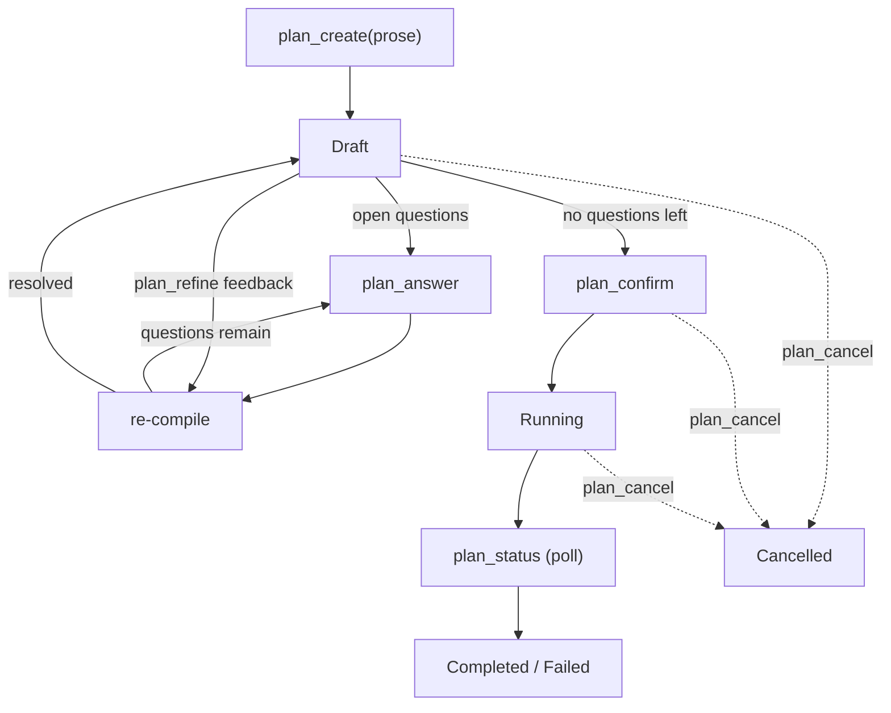

# flowd

Local-first memory, orchestration, and rules engine for AI coding agents. Exposes an MCP server so Claude Code and Cursor can persist context, run multi-step plans, and gate actions against user-defined rules.

## Table of Contents

- [Architecture](#architecture)
- [Install](#install)
  - [Qdrant via Podman](#qdrant-via-podman)
- [Intended usage flow](#intended-usage-flow)
  - [1. Check status](#1-check-status)
  - [2. Wire your agent](#2-wire-your-agent)
  - [3. Use the agent](#3-use-the-agent)
  - [4. Observe out-of-band](#4-observe-out-of-band)
  - [5. Inspect](#5-inspect)
  - [6. Shut down](#6-shut-down)
- [Recommendations](#recommendations)
- [Development](#development)
- [License](#license)

## Architecture

Five crates, no implicit coupling:

| Crate            | Role                                                                        |
| ---------------- | --------------------------------------------------------------------------- |
| `flowd-core`     | Traits and domain types: memory, rules, orchestration. No I/O.              |
| `flowd-storage`  | `SQLite` backend with FTS5 keyword search and WAL-mode concurrent readers.  |
| `flowd-vector`   | Qdrant vector index backend.                                                |
| `flowd-onnx`     | ONNX embedding provider (runs on CPU thread pool).                          |
| `flowd-mcp`      | JSON-RPC 2.0 MCP server. Generic over backends; pulls in no storage deps.   |
| `flowd-cli`      | `flowd` binary. Composes the stack and wires the daemon lifecycle.          |

Search is hybrid: FTS5 keyword and ANN vector results merged via Reciprocal Rank Fusion. Keyword search works without the daemon; vector search needs Qdrant and a running `flowd start`.

## Install

Prerequisites:

- Rust 1.85 or newer
- Qdrant reachable on `http://localhost:6334` (default; see [Qdrant via Podman](#qdrant-via-podman) or override with `flowd start --qdrant-url`)
- For hooks: `bash`, `jq`, `uuidgen`

Build and install:

```bash
cargo install --path crates/flowd-cli
```

This writes the `flowd` binary to `~/.cargo/bin`, which should already be on `$PATH` if you installed Rust via `rustup`.

### Qdrant via Podman

`flowd` talks to Qdrant over gRPC on port `6334`. The recommended local setup is a named container backed by a named volume so the index survives container churn:

```bash
podman volume create qdrant-data

podman run -d \
  --name qdrant \
  --restart=unless-stopped \
  -p 6333:6333 \
  -p 6334:6334 \
  -v qdrant-data:/qdrant/storage:Z \
  docker.io/qdrant/qdrant:v1.17.0
```

Port `6333` exposes the REST API and dashboard at <http://localhost:6333/dashboard>. Port `6334` is the gRPC endpoint `flowd` uses. The `:Z` suffix is a no-op on macOS and does the correct SELinux relabel on Linux.

Day-to-day:

```bash
podman start qdrant      # after reboot or `podman machine` restart
podman stop qdrant
podman logs -f qdrant
```

#### Autostart on Linux (user systemd)

`--restart=unless-stopped` only fires while the user's Podman session is alive, so on a fresh login (or after reboot) the container stays down. To make Qdrant survive both, generate a user systemd unit from the running container and enable lingering so the unit keeps running after logout:

```bash
mkdir -p ~/.config/systemd/user
podman generate systemd --new --name qdrant > ~/.config/systemd/user/qdrant.service
systemctl --user daemon-reload
systemctl --user enable --now qdrant.service
sudo loginctl enable-linger "$USER"
```

`--new` makes the unit recreate the container from the image on each start (rather than depending on a pre-existing container by id), so the unit is portable across reinstalls. `podman generate systemd` is deprecated in Podman 4.4+ in favour of [Quadlet](https://docs.podman.io/en/latest/markdown/podman-systemd.unit.5.html) (`~/.config/containers/systemd/qdrant.container`), but the generated unit remains supported and is the most direct path from `podman run` to a managed service.

To upgrade, pull the new tag and recreate the container against the same volume:

```bash
podman pull docker.io/qdrant/qdrant:v1.17.1
podman rm -f qdrant
podman run -d --name qdrant --restart=unless-stopped \
  -p 6333:6333 -p 6334:6334 \
  -v qdrant-data:/qdrant/storage:Z \
  docker.io/qdrant/qdrant:v1.17.1
```

Pin tags explicitly. Floating tags like `v1.17` or `latest` make "it worked yesterday" impossible to reproduce.

> [!NOTE]
> **macOS:** `podman machine start` must be running for the container to be reachable on `localhost`. `--restart=unless-stopped` only takes effect while the machine is up; the machine itself is not auto-started by Podman Desktop unless you enable it.

## Intended usage flow

### 1. Check status

```bash
flowd status
```

Reports the flowd home layout, daemon liveness, and row counts per memory tier. A fresh install shows zero rows and no PID.

### 2. Wire your agent

Configure one or both clients using the templates under `integrations/`:

- Claude Code: `integrations/claude-code/settings.json` plus the three hook scripts under `hooks/`. Merge into `~/.claude/settings.json` after replacing `/ABSOLUTE/PATH`.
- Cursor: `integrations/cursor/mcp.json` copied to `~/.cursor/mcp.json` or `<repo>/.cursor/mcp.json`.

Both clients spawn `flowd start` as a stdio subprocess. You do not run the daemon yourself.

### 3. Use the agent

The agent now has twelve MCP tools. Inside a Claude Code or Cursor session:

| Tool             | When the agent calls it                                                                |
| ---------------- | -------------------------------------------------------------------------------------- |
| `memory_store`   | To persist a decision, design note, or tool result.                                    |
| `memory_search`  | To recall prior observations by keyword or semantic similarity.                        |
| `memory_context` | Auto-injection at file or session scope (skips cold tier).                             |
| `plan_create`    | To submit a plan, either as a structured DAG (`definition`) or as `prose`.             |
| `plan_answer`    | To resolve open clarification questions emitted by the prose-first compiler.           |
| `plan_refine`    | To apply freeform feedback to a draft plan and re-compile.                             |
| `plan_confirm`   | To advance a plan from draft to running after human review.                            |
| `plan_cancel`    | To abandon a draft, confirmed, or running plan.                                        |
| `plan_status`    | To poll execution progress.                                                            |
| `plan_resume`    | To reset failed steps on a stalled plan and re-execute from the failure boundary.      |
| `rules_check`    | Pre-flight gate before a risky tool invocation.                                        |
| `rules_list`     | To enumerate rules active for the current project or file scope.                       |

Rules are YAML files under `~/.flowd/rules/` (global) and `<repo>/.flowd/rules/` (project). See `flowd-core/src/rules/loader.rs` for the schema. To inspect what the daemon loaded, run `flowd rules list -p <project>` (or `-f <file>`). Bare `flowd rules list` evaluates against an empty scope and returns no matches even when rules are loaded.

#### Prose-first planning

`plan_create` accepts either a structured `definition` (the legacy DAG-first path) or a `prose` description. Prose plans are passed to the configured `PlanCompiler`, which can either compile them straight to a DAG or surface a list of `OpenQuestion`s the agent must resolve before the plan can run. The clarification loop is:



The daemon ships with [`StubPlanCompiler`](crates/flowd-mcp/src/compiler.rs), a deterministic, no-LLM compiler that parses already-structured markdown:

```text
# refactor-auth

## extract-jwt [agent: rust-engineer]
Pull the JWT helpers out of `auth/mod.rs`.

## migrate-callers [agent: rust-engineer] depends_on: [extract-jwt]
Update every call site to use the new module.

## smoke-test [agent: tester] depends_on: [migrate-callers]
Run the integration tests and capture failures.
```

Each `## <step-id> [agent: <type>]` heading defines a step; the body until the next `## ` (or end of file) is the prompt. `depends_on: [a, b]` is optional. When the prose is freeform, the stub surfaces a single `stub.structure_required` open question and waits for the agent to either restructure via `plan_refine` or paste a structured version through `Answer::ExplainMore`.

#### LLM-backed compiler

For freeform prose -- where the input doesn't fit the structured-markdown convention above -- swap `[plan].compiler` to `"llm"`. `LlmPlanCompiler` then routes the prompt through one of three transports, selected by `[plan.llm].provider`:

| Provider     | Wire name      | When to use                                                                                                |
| ------------ | -------------- | ---------------------------------------------------------------------------------------------------------- |
| Claude CLI   | `claude-cli`   | Default. Shells out to the local `claude` binary; no API key in `flowd`.                                   |
| MLX (local)  | `mlx`          | Any OpenAI `/v1/chat/completions`-compatible local server (Ollama, `mlx_lm.server`, vLLM, llama.cpp, ...). |
| Claude HTTP  | `claude-http`  | Reserved for a follow-up. Direct Anthropic Messages API; will need `ANTHROPIC_API_KEY`.                    |

The `mlx` name is preserved for config-file compatibility but the section configures any OpenAI-shaped local backend; the defaults below target Ollama because that is the most common local setup. MLX users override `base_url` to `http://127.0.0.1:8080/v1` and `model` to a HuggingFace-style id.

A typical `~/.flowd/flowd.toml` for the default Claude-CLI path:

```toml
[plan]
compiler      = "llm"
max_questions = 3

[plan.llm]
provider = "claude-cli"

[plan.llm.claude_cli]
binary       = "claude"   # bare name resolved via $PATH at startup
# `claude -p` accepts tier aliases (`sonnet`, `opus`, `haiku`) which
# auto-resolve to the latest build of that tier, or fully-pinned
# identifiers (e.g. `claude-sonnet-4-5`) for byte-for-byte reproducibility.
model        = "sonnet"
timeout_secs = 120

[plan.llm.mlx]                          # used when provider = "mlx" or as a refine override
# Ollama-shaped defaults; for mlx_lm.server use port 8080 and a
# HuggingFace-style model id (e.g. mlx-community/Qwen3-Coder-30B-...).
base_url     = "http://127.0.0.1:11434/v1"
model        = "qwen3-coder:30b"
timeout_secs = 90
max_tokens   = 4096
temperature  = 0.2
```

Optional **two-tier escalation** -- first compile and answer-merging stay on the primary, but `plan_refine` jumps to a stronger (or different) backend:

```toml
[plan.llm.refine]
provider = "claude-cli"
[plan.llm.refine.claude_cli]
model        = "opus"
binary       = "claude"
timeout_secs = 180
```

**Per-request override.** `plan_create` accepts an optional `compiler_override` field on the prose-first path so a caller can target a specific configured backend without restarting the daemon. Accepted values match the wire names above (`"claude-cli"`, `"mlx"`, `"claude-http"`); pairing the field with `definition` is rejected, since the override only applies to compilation. Subsequent `plan_answer` / `plan_refine` calls always go back through the configured tiers.

**Startup probe asymmetry.** If `claude-cli` is the primary or refine provider, the daemon resolves the binary on `$PATH` and refuses to start when it's missing -- the operator sees the failure before the first request. MLX and (future) Claude-HTTP errors surface lazily, since their backing servers are commonly started after `flowd`.

### 4. Observe out-of-band

Claude Code hooks run outside the MCP session, so they persist through the CLI:

```bash
echo "release cut on main" | flowd observe --project my-repo --session -
```

This writes directly to `SQLite` at `Hot` tier without touching Qdrant or ONNX. Vector search picks up the row after the daemon's next reindex pass. Use this path from any shell automation that needs to feed flowd.

### 5. Inspect

```bash
flowd history --project my-repo          # sessions, newest first
flowd search "query string" --project my-repo
flowd rules list --project my-repo
flowd export -o /tmp/dump                # browsable markdown per project/session
```

All read commands hit `SQLite` directly. `SQLite` WAL mode makes this safe while `flowd start` is running.

### 6. Shut down

```bash
flowd stop
```

Sends `SIGTERM` to the PID in `$FLOWD_HOME/flowd.pid` and cleans the file. Stale PIDs are detected and removed.

## Recommendations

- **Pin `$FLOWD_HOME` per machine, not per project.** Memory is cross-project by design; the `project` field discriminates scope.
- **Keep rules at project scope unless they must apply globally.** Project-local rules live under `<repo>/.flowd/rules/` and load automatically when the agent's `cwd` is inside the repo.
- **Run Qdrant under the same user account that runs `flowd`.** Mixing users produces permission errors that are easier to avoid than debug.
- **Review plan previews.** `plan_create` returns a preview with execution layers and a dependency graph before the plan runs. Read it.
- **Do not rely on hooks for critical persistence.** Hooks swallow errors by design so they never block Claude Code. Anything the agent must remember should go through `memory_store` over MCP, which surfaces failures.
- **Run `flowd export` before upgrading.** Schema migrations are forward-only; a markdown dump is a cheap safety net.

## Development

```bash
cargo check --workspace
cargo clippy --workspace --all-targets -- -D warnings
cargo test --workspace
```

The MCP layer has two integration test suites:

- `crates/flowd-mcp/tests/integration.rs`: wire protocol against stub handlers.
- `crates/flowd-mcp/tests/e2e.rs`: real `SqliteBackend`, in-memory vector stub, real rules, real orchestrator. Exercises the full `initialize` -> `tools/*` -> plan completion cycle and is the canonical regression test for the agent-facing surface.

## License

[MIT](LICENSE).
